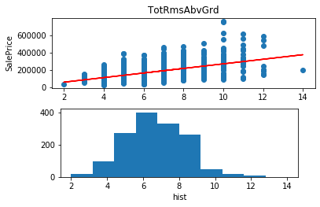

# Kaggle: Housing Prices Competition

Entry for the Kaggle Housing Prices Competition.  Given a set of historical data on housing sale prices, predict the sale price of a home.


```python
import pandas as pd
import numpy as np

from scipy import stats
from scipy.stats import norm, skew 
from scipy.special import boxcox1p

from sklearn.model_selection import train_test_split
# from sklearn.preprocessing import Imputer
from sklearn.impute import SimpleImputer
from sklearn.metrics import mean_absolute_error
from sklearn.preprocessing import LabelEncoder

from xgboost import XGBRegressor
from sklearn.tree import DecisionTreeRegressor

import matplotlib.pyplot as plt
from mpl_toolkits.mplot3d import Axes3D
```

## Load Data

Load train and test data.


```python
# iowa_file_path = '../input/train.csv'  # competition data
iowa_file_path = 'data/train.csv'  # local data
df_train = pd.read_csv(iowa_file_path)

# test_data_path = '../input/test.csv'
test_data_path = 'data/test.csv'
df_test = pd.read_csv(test_data_path)

df_train.head()
```


<div>
<style scoped>
    .dataframe tbody tr th:only-of-type {
        vertical-align: middle;
    }

    .dataframe tbody tr th {
        vertical-align: top;
    }

    .dataframe thead th {
        text-align: right;
    }
</style>
<table border="1" class="dataframe">
  <thead>
    <tr style="text-align: right;">
      <th></th>
      <th>Id</th>
      <th>MSSubClass</th>
      <th>MSZoning</th>
      <th>LotFrontage</th>
      <th>LotArea</th>
      <th>Street</th>
      <th>Alley</th>
      <th>LotShape</th>
      <th>LandContour</th>
      <th>Utilities</th>
      <th>...</th>
      <th>PoolArea</th>
      <th>PoolQC</th>
      <th>Fence</th>
      <th>MiscFeature</th>
      <th>MiscVal</th>
      <th>MoSold</th>
      <th>YrSold</th>
      <th>SaleType</th>
      <th>SaleCondition</th>
      <th>SalePrice</th>
    </tr>
  </thead>
  <tbody>
    <tr>
      <th>0</th>
      <td>1</td>
      <td>60</td>
      <td>RL</td>
      <td>65.0</td>
      <td>8450</td>
      <td>Pave</td>
      <td>NaN</td>
      <td>Reg</td>
      <td>Lvl</td>
      <td>AllPub</td>
      <td>...</td>
      <td>0</td>
      <td>NaN</td>
      <td>NaN</td>
      <td>NaN</td>
      <td>0</td>
      <td>2</td>
      <td>2008</td>
      <td>WD</td>
      <td>Normal</td>
      <td>208500</td>
    </tr>
    <tr>
      <th>1</th>
      <td>2</td>
      <td>20</td>
      <td>RL</td>
      <td>80.0</td>
      <td>9600</td>
      <td>Pave</td>
      <td>NaN</td>
      <td>Reg</td>
      <td>Lvl</td>
      <td>AllPub</td>
      <td>...</td>
      <td>0</td>
      <td>NaN</td>
      <td>NaN</td>
      <td>NaN</td>
      <td>0</td>
      <td>5</td>
      <td>2007</td>
      <td>WD</td>
      <td>Normal</td>
      <td>181500</td>
    </tr>
    <tr>
      <th>2</th>
      <td>3</td>
      <td>60</td>
      <td>RL</td>
      <td>68.0</td>
      <td>11250</td>
      <td>Pave</td>
      <td>NaN</td>
      <td>IR1</td>
      <td>Lvl</td>
      <td>AllPub</td>
      <td>...</td>
      <td>0</td>
      <td>NaN</td>
      <td>NaN</td>
      <td>NaN</td>
      <td>0</td>
      <td>9</td>
      <td>2008</td>
      <td>WD</td>
      <td>Normal</td>
      <td>223500</td>
    </tr>
    <tr>
      <th>3</th>
      <td>4</td>
      <td>70</td>
      <td>RL</td>
      <td>60.0</td>
      <td>9550</td>
      <td>Pave</td>
      <td>NaN</td>
      <td>IR1</td>
      <td>Lvl</td>
      <td>AllPub</td>
      <td>...</td>
      <td>0</td>
      <td>NaN</td>
      <td>NaN</td>
      <td>NaN</td>
      <td>0</td>
      <td>2</td>
      <td>2006</td>
      <td>WD</td>
      <td>Abnorml</td>
      <td>140000</td>
    </tr>
    <tr>
      <th>4</th>
      <td>5</td>
      <td>60</td>
      <td>RL</td>
      <td>84.0</td>
      <td>14260</td>
      <td>Pave</td>
      <td>NaN</td>
      <td>IR1</td>
      <td>Lvl</td>
      <td>AllPub</td>
      <td>...</td>
      <td>0</td>
      <td>NaN</td>
      <td>NaN</td>
      <td>NaN</td>
      <td>0</td>
      <td>12</td>
      <td>2008</td>
      <td>WD</td>
      <td>Normal</td>
      <td>250000</td>
    </tr>
  </tbody>
</table>
<p>5 rows × 81 columns</p>
</div>


## EDA

Explore the data.

### Shape

We have 81 dimensions (features) and 1460 entries (rows).


```python
print(df_train.shape)
print(df_test.shape)
```

    (1460, 81)
    (1459, 80)


### Dtypes

We have int64's, floats, and objects.  We'll need to take a closer look at those objects.  They may be misclassified (can convert to numeric) or they may be categorical.  


```python
df_train.dtypes
```


    Id                 int64
    MSSubClass         int64
    MSZoning          object
    LotFrontage      float64
    LotArea            int64
                      ...   
    MoSold             int64
    YrSold             int64
    SaleType          object
    SaleCondition     object
    SalePrice          int64
    Length: 81, dtype: object


```python
df_train.describe()
```


<div>
<style scoped>
    .dataframe tbody tr th:only-of-type {
        vertical-align: middle;
    }

    .dataframe tbody tr th {
        vertical-align: top;
    }

    .dataframe thead th {
        text-align: right;
    }
</style>
<table border="1" class="dataframe">
  <thead>
    <tr style="text-align: right;">
      <th></th>
      <th>Id</th>
      <th>MSSubClass</th>
      <th>LotFrontage</th>
      <th>LotArea</th>
      <th>OverallQual</th>
      <th>OverallCond</th>
      <th>YearBuilt</th>
      <th>YearRemodAdd</th>
      <th>MasVnrArea</th>
      <th>BsmtFinSF1</th>
      <th>...</th>
      <th>WoodDeckSF</th>
      <th>OpenPorchSF</th>
      <th>EnclosedPorch</th>
      <th>3SsnPorch</th>
      <th>ScreenPorch</th>
      <th>PoolArea</th>
      <th>MiscVal</th>
      <th>MoSold</th>
      <th>YrSold</th>
      <th>SalePrice</th>
    </tr>
  </thead>
  <tbody>
    <tr>
      <th>count</th>
      <td>1460.000000</td>
      <td>1460.000000</td>
      <td>1201.000000</td>
      <td>1460.000000</td>
      <td>1460.000000</td>
      <td>1460.000000</td>
      <td>1460.000000</td>
      <td>1460.000000</td>
      <td>1452.000000</td>
      <td>1460.000000</td>
      <td>...</td>
      <td>1460.000000</td>
      <td>1460.000000</td>
      <td>1460.000000</td>
      <td>1460.000000</td>
      <td>1460.000000</td>
      <td>1460.000000</td>
      <td>1460.000000</td>
      <td>1460.000000</td>
      <td>1460.000000</td>
      <td>1460.000000</td>
    </tr>
    <tr>
      <th>mean</th>
      <td>730.500000</td>
      <td>56.897260</td>
      <td>70.049958</td>
      <td>10516.828082</td>
      <td>6.099315</td>
      <td>5.575342</td>
      <td>1971.267808</td>
      <td>1984.865753</td>
      <td>103.685262</td>
      <td>443.639726</td>
      <td>...</td>
      <td>94.244521</td>
      <td>46.660274</td>
      <td>21.954110</td>
      <td>3.409589</td>
      <td>15.060959</td>
      <td>2.758904</td>
      <td>43.489041</td>
      <td>6.321918</td>
      <td>2007.815753</td>
      <td>180921.195890</td>
    </tr>
    <tr>
      <th>std</th>
      <td>421.610009</td>
      <td>42.300571</td>
      <td>24.284752</td>
      <td>9981.264932</td>
      <td>1.382997</td>
      <td>1.112799</td>
      <td>30.202904</td>
      <td>20.645407</td>
      <td>181.066207</td>
      <td>456.098091</td>
      <td>...</td>
      <td>125.338794</td>
      <td>66.256028</td>
      <td>61.119149</td>
      <td>29.317331</td>
      <td>55.757415</td>
      <td>40.177307</td>
      <td>496.123024</td>
      <td>2.703626</td>
      <td>1.328095</td>
      <td>79442.502883</td>
    </tr>
    <tr>
      <th>min</th>
      <td>1.000000</td>
      <td>20.000000</td>
      <td>21.000000</td>
      <td>1300.000000</td>
      <td>1.000000</td>
      <td>1.000000</td>
      <td>1872.000000</td>
      <td>1950.000000</td>
      <td>0.000000</td>
      <td>0.000000</td>
      <td>...</td>
      <td>0.000000</td>
      <td>0.000000</td>
      <td>0.000000</td>
      <td>0.000000</td>
      <td>0.000000</td>
      <td>0.000000</td>
      <td>0.000000</td>
      <td>1.000000</td>
      <td>2006.000000</td>
      <td>34900.000000</td>
    </tr>
    <tr>
      <th>25%</th>
      <td>365.750000</td>
      <td>20.000000</td>
      <td>59.000000</td>
      <td>7553.500000</td>
      <td>5.000000</td>
      <td>5.000000</td>
      <td>1954.000000</td>
      <td>1967.000000</td>
      <td>0.000000</td>
      <td>0.000000</td>
      <td>...</td>
      <td>0.000000</td>
      <td>0.000000</td>
      <td>0.000000</td>
      <td>0.000000</td>
      <td>0.000000</td>
      <td>0.000000</td>
      <td>0.000000</td>
      <td>5.000000</td>
      <td>2007.000000</td>
      <td>129975.000000</td>
    </tr>
    <tr>
      <th>50%</th>
      <td>730.500000</td>
      <td>50.000000</td>
      <td>69.000000</td>
      <td>9478.500000</td>
      <td>6.000000</td>
      <td>5.000000</td>
      <td>1973.000000</td>
      <td>1994.000000</td>
      <td>0.000000</td>
      <td>383.500000</td>
      <td>...</td>
      <td>0.000000</td>
      <td>25.000000</td>
      <td>0.000000</td>
      <td>0.000000</td>
      <td>0.000000</td>
      <td>0.000000</td>
      <td>0.000000</td>
      <td>6.000000</td>
      <td>2008.000000</td>
      <td>163000.000000</td>
    </tr>
    <tr>
      <th>75%</th>
      <td>1095.250000</td>
      <td>70.000000</td>
      <td>80.000000</td>
      <td>11601.500000</td>
      <td>7.000000</td>
      <td>6.000000</td>
      <td>2000.000000</td>
      <td>2004.000000</td>
      <td>166.000000</td>
      <td>712.250000</td>
      <td>...</td>
      <td>168.000000</td>
      <td>68.000000</td>
      <td>0.000000</td>
      <td>0.000000</td>
      <td>0.000000</td>
      <td>0.000000</td>
      <td>0.000000</td>
      <td>8.000000</td>
      <td>2009.000000</td>
      <td>214000.000000</td>
    </tr>
    <tr>
      <th>max</th>
      <td>1460.000000</td>
      <td>190.000000</td>
      <td>313.000000</td>
      <td>215245.000000</td>
      <td>10.000000</td>
      <td>9.000000</td>
      <td>2010.000000</td>
      <td>2010.000000</td>
      <td>1600.000000</td>
      <td>5644.000000</td>
      <td>...</td>
      <td>857.000000</td>
      <td>547.000000</td>
      <td>552.000000</td>
      <td>508.000000</td>
      <td>480.000000</td>
      <td>738.000000</td>
      <td>15500.000000</td>
      <td>12.000000</td>
      <td>2010.000000</td>
      <td>755000.000000</td>
    </tr>
  </tbody>
</table>
<p>8 rows × 38 columns</p>
</div>


### Target

Let's take a look at our target (dependent variable).


```python
plt.hist(df_train['SalePrice'], label='SalePrice')
plt.legend()
plt.show()
```


### Compare Feature to Target

Pick a feature that should be somewhat correlated to the target value and create a scatter plot to see how linear the relationship might be.


```python
plt.scatter(df_train['BedroomAbvGr'], df_train['SalePrice'])
plt.show()
```


#### Add Best Fit Line

For reference, let's do a simple 1D linear regression and display the best fit line on the plot.


```python
# define a function we can use to examine other features as well
# 1D linear regression
def linear_regression_plot(X, y, label=None):
    denominator = X.dot(X) - X.mean() * X.sum()
    a = ( X.dot(y) - y.mean()*X.sum() ) / denominator
    b = ( y.mean() * X.dot(X) - X.mean() * X.dot(y) ) / denominator

    # let's calculate the predicted Y
    test_preds = a*X + b

    # let's plot everything together to make sure it worked
    # plt.scatter(X, y)
    # plt.plot(X, test_preds)
    # plt.show()
    
    fig = plt.figure()
    fig.subplots_adjust(top=0.8)
    ax1 = fig.add_subplot(211)
    ax1.set_ylabel('SalePrice')
    if label:
        ax1.set_title(label)
    ax1.scatter(X, y)
    ax1.plot(X, test_preds, color='r')
    
    ax2 = fig.add_axes([0.15, 0.1, 0.7, 0.3])
    ax2.hist(X)
    ax2.set_xlabel('hist')
    
    plt.show()
    
    val_mae = mean_absolute_error(test_preds, y)
    print("Validation MAE for {}: {:,.0f}".format(label, val_mae))
```


```python
linear_regression_plot(df_train['BedroomAbvGr'], df_train['SalePrice'])
```


    Validation MAE for None: 56,420


### Plot Features

Let's take a look at the plots of some other features of interest.


```python
# let's take a look at all the features we might be interested in
features = ['GrLivArea', 'LotArea', 'YearBuilt', '1stFlrSF', '2ndFlrSF', 'FullBath', 'BedroomAbvGr', 'TotRmsAbvGrd']

for feature in features:
    linear_regression_plot(df_train[feature], df_train['SalePrice'], label=feature)
```


    Validation MAE for GrLivArea: 37,639


    Validation MAE for LotArea: 55,122


    Validation MAE for YearBuilt: 47,024


    Validation MAE for 1stFlrSF: 46,242


    Validation MAE for 2ndFlrSF: 53,849


    Validation MAE for FullBath: 44,926


    Validation MAE for BedroomAbvGr: 56,420





    Validation MAE for TotRmsAbvGrd: 47,387


## Data Pre-Processing

Get the data ready for ML.


```python
# drop rows without a sale price
df_train = df_train.dropna(axis=0, subset=['SalePrice'])
```


```python
# remove the logical outlier of a large house with low price
df_train = df_train.drop(df_train[(df_train['GrLivArea'] > 4000) & (df_train['SalePrice'] < 300000)].index)
```


```python
# let's take the log of the target, log(1+x)
# df_train["SalePrice"] = np.log1p(df_train["SalePrice"])

# plt.hist(df_train['SalePrice'], label='SalePrice')
# plt.legend()
# plt.show()
```


```python
# fill missing values
obj_features = ['PoolQC', 'MiscFeature', 'Alley', 'Fence', 'FireplaceQu', 'GarageType', 'GarageFinish', 'GarageQual', 
                'GarageCond', 'BsmtQual', 'BsmtCond', 'BsmtExposure', 'BsmtFinType1', 'BsmtFinType2', 'MasVnrType',
                'MSSubClass', 'OverallCond', 'YrSold', 'MoSold', 'ExterQual', 'ExterCond', 'HeatingQC', 'KitchenQual',
                'Functional', 'LandSlope', 'LotShape', 'PavedDrive', 'Street', 'CentralAir']

# obj_features = df.select_dtypes(include=['object'])
for feature in obj_features:
    df_train[feature] = df_train[feature].fillna("None")
    df_test[feature] = df_test[feature].fillna("None")

numeric_features = ['GarageYrBlt', 'GarageArea', 'GarageCars', 'BsmtFinSF1', 'BsmtFinSF2', 'BsmtUnfSF', 'TotalBsmtSF',
                   'BsmtFullBath', 'BsmtHalfBath', 'MasVnrArea']

# numeric_features = df.select_dtypes(exclude=['object'])
for feature in numeric_features:
    df_train[feature] = df_train[feature].fillna(0)
    df_test[feature] = df_test[feature].fillna(0)
```

### Categories

Convert some of the object fields to str categories.


```python
category_features = ['OverallCond', 'YrSold', 'MoSold', 'FireplaceQu', 'BsmtQual', 'BsmtCond', 'GarageQual', 
                     'GarageCond', 'ExterQual', 'ExterCond', 'HeatingQC', 'PoolQC', 'KitchenQual', 'BsmtFinType1',
                     'BsmtFinType2', 'Functional', 'Fence', 'BsmtExposure', 'GarageFinish', 'LandSlope',
                     'LotShape', 'PavedDrive', 'Street', 'Alley', 'CentralAir', 'MSSubClass']

for feature in category_features:
    df_train[feature] = df_train[feature].astype(str)
    label = LabelEncoder()
    label.fit(list(df_train[feature].values))
    df_train[feature] = label.transform(list(df_train[feature].values))

for feature in category_features:
    df_test[feature] = df_test[feature].astype(str)
    label = LabelEncoder()
    label.fit(list(df_test[feature].values))
    df_test[feature] = label.transform(list(df_test[feature].values))
    
df_train.head()
```


<div>
<style scoped>
    .dataframe tbody tr th:only-of-type {
        vertical-align: middle;
    }

    .dataframe tbody tr th {
        vertical-align: top;
    }

    .dataframe thead th {
        text-align: right;
    }
</style>
<table border="1" class="dataframe">
  <thead>
    <tr style="text-align: right;">
      <th></th>
      <th>Id</th>
      <th>MSSubClass</th>
      <th>MSZoning</th>
      <th>LotFrontage</th>
      <th>LotArea</th>
      <th>Street</th>
      <th>Alley</th>
      <th>LotShape</th>
      <th>LandContour</th>
      <th>Utilities</th>
      <th>...</th>
      <th>PoolArea</th>
      <th>PoolQC</th>
      <th>Fence</th>
      <th>MiscFeature</th>
      <th>MiscVal</th>
      <th>MoSold</th>
      <th>YrSold</th>
      <th>SaleType</th>
      <th>SaleCondition</th>
      <th>SalePrice</th>
    </tr>
  </thead>
  <tbody>
    <tr>
      <th>0</th>
      <td>1</td>
      <td>9</td>
      <td>RL</td>
      <td>65.0</td>
      <td>8450</td>
      <td>1</td>
      <td>1</td>
      <td>3</td>
      <td>Lvl</td>
      <td>AllPub</td>
      <td>...</td>
      <td>0</td>
      <td>3</td>
      <td>4</td>
      <td>None</td>
      <td>0</td>
      <td>4</td>
      <td>2</td>
      <td>WD</td>
      <td>Normal</td>
      <td>208500</td>
    </tr>
    <tr>
      <th>1</th>
      <td>2</td>
      <td>4</td>
      <td>RL</td>
      <td>80.0</td>
      <td>9600</td>
      <td>1</td>
      <td>1</td>
      <td>3</td>
      <td>Lvl</td>
      <td>AllPub</td>
      <td>...</td>
      <td>0</td>
      <td>3</td>
      <td>4</td>
      <td>None</td>
      <td>0</td>
      <td>7</td>
      <td>1</td>
      <td>WD</td>
      <td>Normal</td>
      <td>181500</td>
    </tr>
    <tr>
      <th>2</th>
      <td>3</td>
      <td>9</td>
      <td>RL</td>
      <td>68.0</td>
      <td>11250</td>
      <td>1</td>
      <td>1</td>
      <td>0</td>
      <td>Lvl</td>
      <td>AllPub</td>
      <td>...</td>
      <td>0</td>
      <td>3</td>
      <td>4</td>
      <td>None</td>
      <td>0</td>
      <td>11</td>
      <td>2</td>
      <td>WD</td>
      <td>Normal</td>
      <td>223500</td>
    </tr>
    <tr>
      <th>3</th>
      <td>4</td>
      <td>10</td>
      <td>RL</td>
      <td>60.0</td>
      <td>9550</td>
      <td>1</td>
      <td>1</td>
      <td>0</td>
      <td>Lvl</td>
      <td>AllPub</td>
      <td>...</td>
      <td>0</td>
      <td>3</td>
      <td>4</td>
      <td>None</td>
      <td>0</td>
      <td>4</td>
      <td>0</td>
      <td>WD</td>
      <td>Abnorml</td>
      <td>140000</td>
    </tr>
    <tr>
      <th>4</th>
      <td>5</td>
      <td>9</td>
      <td>RL</td>
      <td>84.0</td>
      <td>14260</td>
      <td>1</td>
      <td>1</td>
      <td>0</td>
      <td>Lvl</td>
      <td>AllPub</td>
      <td>...</td>
      <td>0</td>
      <td>3</td>
      <td>4</td>
      <td>None</td>
      <td>0</td>
      <td>3</td>
      <td>2</td>
      <td>WD</td>
      <td>Normal</td>
      <td>250000</td>
    </tr>
  </tbody>
</table>
<p>5 rows × 81 columns</p>
</div>


### Skewness

Some of the data is a bit skewed.  Let's try to correct that.


```python
skewed_features = df_train[numeric_features].apply(lambda x: skew(x.dropna())).sort_values(ascending=False)
skewed_features_test = df_test[numeric_features].apply(lambda x: skew(x.dropna())).sort_values(ascending=False)

skewness = pd.DataFrame({'Skew': skewed_features})
skewness = skewness[abs(skewness) > 0.75]

skewness_test = pd.DataFrame({'Skew': skewed_features_test})
skewness_test = skewness_test[abs(skewness_test) > 0.75]

print(skewness.shape)
skewness
```

    (10, 1)


<div>
<style scoped>
    .dataframe tbody tr th:only-of-type {
        vertical-align: middle;
    }

    .dataframe tbody tr th {
        vertical-align: top;
    }

    .dataframe thead th {
        text-align: right;
    }
</style>
<table border="1" class="dataframe">
  <thead>
    <tr style="text-align: right;">
      <th></th>
      <th>Skew</th>
    </tr>
  </thead>
  <tbody>
    <tr>
      <th>BsmtFinSF2</th>
      <td>4.247550</td>
    </tr>
    <tr>
      <th>BsmtHalfBath</th>
      <td>4.095895</td>
    </tr>
    <tr>
      <th>MasVnrArea</th>
      <td>2.693554</td>
    </tr>
    <tr>
      <th>BsmtUnfSF</th>
      <td>0.919955</td>
    </tr>
    <tr>
      <th>BsmtFinSF1</th>
      <td>0.764002</td>
    </tr>
    <tr>
      <th>BsmtFullBath</th>
      <td>NaN</td>
    </tr>
    <tr>
      <th>TotalBsmtSF</th>
      <td>NaN</td>
    </tr>
    <tr>
      <th>GarageArea</th>
      <td>NaN</td>
    </tr>
    <tr>
      <th>GarageCars</th>
      <td>NaN</td>
    </tr>
    <tr>
      <th>GarageYrBlt</th>
      <td>-3.862401</td>
    </tr>
  </tbody>
</table>
</div>


```python
skewed_features = skewness.index
lam = 0.15
for feature in skewed_features:
    df_train[feature] = boxcox1p(df_train[feature], lam)
    
skewed_features_test = skewness_test.index
for feature in skewed_features_test:
    df_test[feature] = boxcox1p(df_test[feature], lam)
```


```python
# explode the categories into 1s, 0s    
# df_train = pd.get_dummies(df_train)
# df_test = pd.get_dummies(df_test)

print(df_train.shape)
df_train.head()
```

    (1458, 81)


<div>
<style scoped>
    .dataframe tbody tr th:only-of-type {
        vertical-align: middle;
    }

    .dataframe tbody tr th {
        vertical-align: top;
    }

    .dataframe thead th {
        text-align: right;
    }
</style>
<table border="1" class="dataframe">
  <thead>
    <tr style="text-align: right;">
      <th></th>
      <th>Id</th>
      <th>MSSubClass</th>
      <th>MSZoning</th>
      <th>LotFrontage</th>
      <th>LotArea</th>
      <th>Street</th>
      <th>Alley</th>
      <th>LotShape</th>
      <th>LandContour</th>
      <th>Utilities</th>
      <th>...</th>
      <th>PoolArea</th>
      <th>PoolQC</th>
      <th>Fence</th>
      <th>MiscFeature</th>
      <th>MiscVal</th>
      <th>MoSold</th>
      <th>YrSold</th>
      <th>SaleType</th>
      <th>SaleCondition</th>
      <th>SalePrice</th>
    </tr>
  </thead>
  <tbody>
    <tr>
      <th>0</th>
      <td>1</td>
      <td>9</td>
      <td>RL</td>
      <td>65.0</td>
      <td>8450</td>
      <td>1</td>
      <td>1</td>
      <td>3</td>
      <td>Lvl</td>
      <td>AllPub</td>
      <td>...</td>
      <td>0</td>
      <td>3</td>
      <td>4</td>
      <td>None</td>
      <td>0</td>
      <td>4</td>
      <td>2</td>
      <td>WD</td>
      <td>Normal</td>
      <td>208500</td>
    </tr>
    <tr>
      <th>1</th>
      <td>2</td>
      <td>4</td>
      <td>RL</td>
      <td>80.0</td>
      <td>9600</td>
      <td>1</td>
      <td>1</td>
      <td>3</td>
      <td>Lvl</td>
      <td>AllPub</td>
      <td>...</td>
      <td>0</td>
      <td>3</td>
      <td>4</td>
      <td>None</td>
      <td>0</td>
      <td>7</td>
      <td>1</td>
      <td>WD</td>
      <td>Normal</td>
      <td>181500</td>
    </tr>
    <tr>
      <th>2</th>
      <td>3</td>
      <td>9</td>
      <td>RL</td>
      <td>68.0</td>
      <td>11250</td>
      <td>1</td>
      <td>1</td>
      <td>0</td>
      <td>Lvl</td>
      <td>AllPub</td>
      <td>...</td>
      <td>0</td>
      <td>3</td>
      <td>4</td>
      <td>None</td>
      <td>0</td>
      <td>11</td>
      <td>2</td>
      <td>WD</td>
      <td>Normal</td>
      <td>223500</td>
    </tr>
    <tr>
      <th>3</th>
      <td>4</td>
      <td>10</td>
      <td>RL</td>
      <td>60.0</td>
      <td>9550</td>
      <td>1</td>
      <td>1</td>
      <td>0</td>
      <td>Lvl</td>
      <td>AllPub</td>
      <td>...</td>
      <td>0</td>
      <td>3</td>
      <td>4</td>
      <td>None</td>
      <td>0</td>
      <td>4</td>
      <td>0</td>
      <td>WD</td>
      <td>Abnorml</td>
      <td>140000</td>
    </tr>
    <tr>
      <th>4</th>
      <td>5</td>
      <td>9</td>
      <td>RL</td>
      <td>84.0</td>
      <td>14260</td>
      <td>1</td>
      <td>1</td>
      <td>0</td>
      <td>Lvl</td>
      <td>AllPub</td>
      <td>...</td>
      <td>0</td>
      <td>3</td>
      <td>4</td>
      <td>None</td>
      <td>0</td>
      <td>3</td>
      <td>2</td>
      <td>WD</td>
      <td>Normal</td>
      <td>250000</td>
    </tr>
  </tbody>
</table>
<p>5 rows × 81 columns</p>
</div>


## ML

Time for some ML.  XGBoost is the model that has worked best for this data so far.


```python
y = df_train['SalePrice']
X = df_train.drop(['SalePrice'], axis=1).select_dtypes(exclude=['object'])
print(X.shape)

train_X, val_X, train_y, val_y = train_test_split(X, y, test_size=0.25)
X.head()
```

    (1458, 59)


<div>
<style scoped>
    .dataframe tbody tr th:only-of-type {
        vertical-align: middle;
    }

    .dataframe tbody tr th {
        vertical-align: top;
    }

    .dataframe thead th {
        text-align: right;
    }
</style>
<table border="1" class="dataframe">
  <thead>
    <tr style="text-align: right;">
      <th></th>
      <th>Id</th>
      <th>MSSubClass</th>
      <th>LotFrontage</th>
      <th>LotArea</th>
      <th>Street</th>
      <th>Alley</th>
      <th>LotShape</th>
      <th>LandSlope</th>
      <th>OverallQual</th>
      <th>OverallCond</th>
      <th>...</th>
      <th>OpenPorchSF</th>
      <th>EnclosedPorch</th>
      <th>3SsnPorch</th>
      <th>ScreenPorch</th>
      <th>PoolArea</th>
      <th>PoolQC</th>
      <th>Fence</th>
      <th>MiscVal</th>
      <th>MoSold</th>
      <th>YrSold</th>
    </tr>
  </thead>
  <tbody>
    <tr>
      <th>0</th>
      <td>1</td>
      <td>9</td>
      <td>65.0</td>
      <td>8450</td>
      <td>1</td>
      <td>1</td>
      <td>3</td>
      <td>0</td>
      <td>7</td>
      <td>4</td>
      <td>...</td>
      <td>61</td>
      <td>0</td>
      <td>0</td>
      <td>0</td>
      <td>0</td>
      <td>3</td>
      <td>4</td>
      <td>0</td>
      <td>4</td>
      <td>2</td>
    </tr>
    <tr>
      <th>1</th>
      <td>2</td>
      <td>4</td>
      <td>80.0</td>
      <td>9600</td>
      <td>1</td>
      <td>1</td>
      <td>3</td>
      <td>0</td>
      <td>6</td>
      <td>7</td>
      <td>...</td>
      <td>0</td>
      <td>0</td>
      <td>0</td>
      <td>0</td>
      <td>0</td>
      <td>3</td>
      <td>4</td>
      <td>0</td>
      <td>7</td>
      <td>1</td>
    </tr>
    <tr>
      <th>2</th>
      <td>3</td>
      <td>9</td>
      <td>68.0</td>
      <td>11250</td>
      <td>1</td>
      <td>1</td>
      <td>0</td>
      <td>0</td>
      <td>7</td>
      <td>4</td>
      <td>...</td>
      <td>42</td>
      <td>0</td>
      <td>0</td>
      <td>0</td>
      <td>0</td>
      <td>3</td>
      <td>4</td>
      <td>0</td>
      <td>11</td>
      <td>2</td>
    </tr>
    <tr>
      <th>3</th>
      <td>4</td>
      <td>10</td>
      <td>60.0</td>
      <td>9550</td>
      <td>1</td>
      <td>1</td>
      <td>0</td>
      <td>0</td>
      <td>7</td>
      <td>4</td>
      <td>...</td>
      <td>35</td>
      <td>272</td>
      <td>0</td>
      <td>0</td>
      <td>0</td>
      <td>3</td>
      <td>4</td>
      <td>0</td>
      <td>4</td>
      <td>0</td>
    </tr>
    <tr>
      <th>4</th>
      <td>5</td>
      <td>9</td>
      <td>84.0</td>
      <td>14260</td>
      <td>1</td>
      <td>1</td>
      <td>0</td>
      <td>0</td>
      <td>8</td>
      <td>4</td>
      <td>...</td>
      <td>84</td>
      <td>0</td>
      <td>0</td>
      <td>0</td>
      <td>0</td>
      <td>3</td>
      <td>4</td>
      <td>0</td>
      <td>3</td>
      <td>2</td>
    </tr>
  </tbody>
</table>
<p>5 rows × 59 columns</p>
</div>


```python
my_imputer = SimpleImputer()
train_X = my_imputer.fit_transform(train_X)
val_X = my_imputer.transform(val_X)

my_model = XGBRegressor(n_estimators=170, learning_rate=0.05)
my_model.fit(train_X, train_y, early_stopping_rounds=5,
             eval_set=[(val_X, val_y)], verbose=False)

# create predictions
val_preds = my_model.predict(val_X)
val_mae = mean_absolute_error(val_preds, val_y)
print("Validation MAE for xgboost: {:,.0f}".format(val_mae))
```

    Validation MAE for xgboost: 14,870


## Submission

Create the final model using all the data and submission file.


```python
# create a new model based on all the training data
my_model = XGBRegressor(n_estimators=170, learning_rate=0.05)
my_model.fit(X, y)
```


    XGBRegressor(base_score=0.5, booster=None, colsample_bylevel=1,
                 colsample_bynode=1, colsample_bytree=1, gamma=0, gpu_id=-1,
                 importance_type='gain', interaction_constraints=None,
                 learning_rate=0.05, max_delta_step=0, max_depth=6,
                 min_child_weight=1, missing=nan, monotone_constraints=None,
                 n_estimators=170, n_jobs=0, num_parallel_tree=1,
                 objective='reg:squarederror', random_state=0, reg_alpha=0,
                 reg_lambda=1, scale_pos_weight=1, subsample=1, tree_method=None,
                 validate_parameters=False, verbosity=None)


```python
# test_X with the dimensions we chose for our model
val_X = df_test.select_dtypes(exclude=['object'])

# create predictions
val_preds = my_model.predict(val_X)

output = pd.DataFrame({'Id': df_test.Id, 
                       'SalePrice': val_preds})
output.to_csv('submission.csv', index=False)
```

## Results

Final Score:

- MAE: 15749
- Rank: Top 12% (3173 out of 28296)

2020
