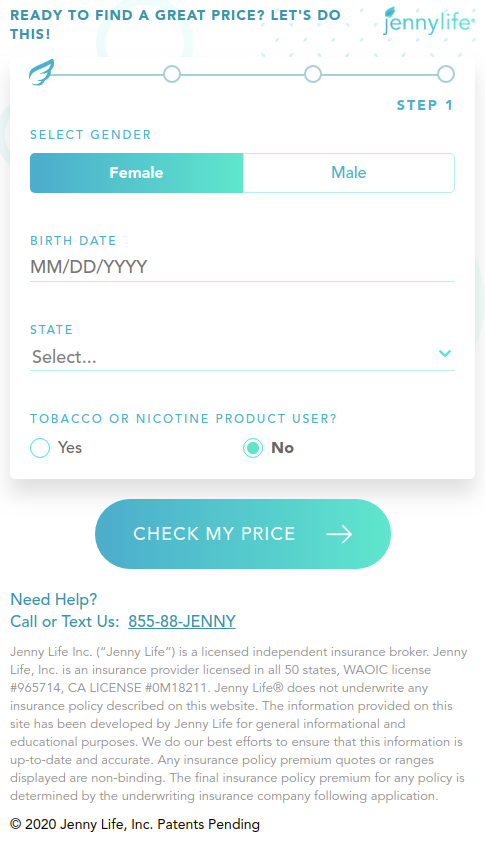

# Jenny Life

For this project, I developed a native Android mobile app, a React web app, a Python/Django ReST API, interfaces to insurance carrier backends using SOAP/XML and Json, as well as an AWS architecture to support the business.

AWS VPC, AWS EC2, NGINX, Unicorn, PostgreSQL, Lambda microservices, Android, Java, RxJava2, Dagger2, Retrofit, React, Python/Django.

## Web App

React web app that allows you to apply for life insurance.

|:--:| 
| *Screenshot of web app.* |

React, Axios, API

