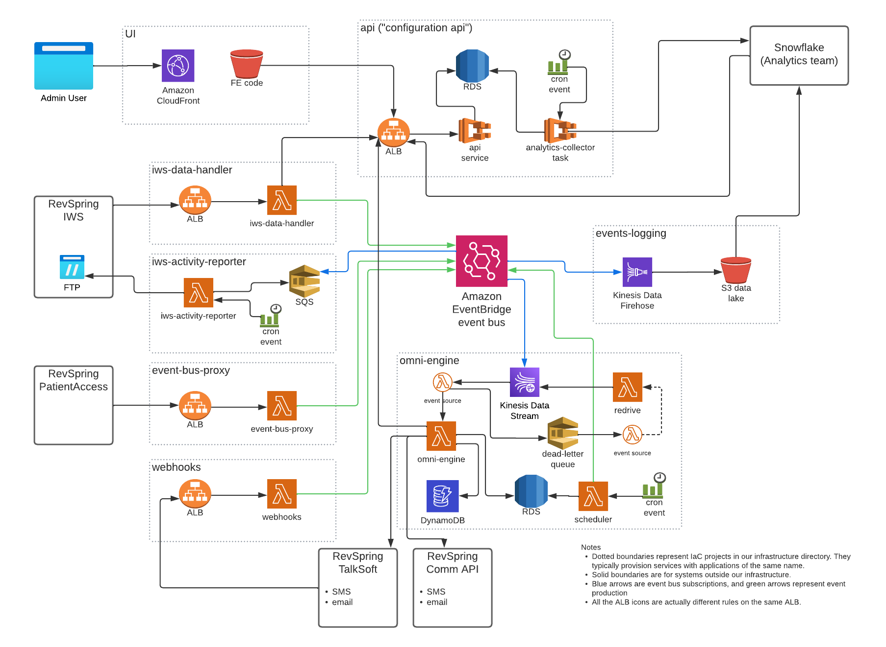

# The OmniChannel Project
High volume, event driven, data processing system for multi-channel customer communications.  OmniChannel became the "brain" of a multi-channel communication system spread across several teams using differing technologies but all with one common goal, to get the right message to the consumer in the right way at the right time.

Events from multiple sources both internal and external fed into OmniChannel.  These events were then matched to the end consumer's persona and preferences.  Business logic would then determine the best channel to communicate with the consumer, e.g. email, sms, voice, or print and on what frequency.

Analytics played a key role in improving response rates and success of campaigns.

In this project, I was responsible for managing and growing a small team of highly skilled developers while contributing significantly to the architecture, system design, and codebase.

AWS Services: EventBright, Kinesis, PostgreSQL RDS, Lambdas, SQS, SNS, ALB, CloudFront, APIGateway, Docker, FastAPI, Python, Javascript, Angular, Pulumi (IaC), Jira, Confluence, Agile, Kanban, Scrum

## Understanding the Business

RevSpring is a healthcare communications company providing hospitals, clinics, and other entities with the ability to send reminders, notices, bills, etc through multiple channels.  Print (snail mail) was the baseline method of communication but email, sms, and voice calls were dominant.  Optimizing these channels for both results and cost were core to the success of the business.

## What benefit does OmniChannel bring?

The ability to provide communications to the client through multiple channels already existed at the company through multiple teams using differing technologies.  To be successful as a new product, OmniChannel must accomplish the following:

- integrate data from multiple disparate teams
- receive and handle millions of messages per month in varying formats
- provide rock solid infrastructure and security
- deliver new messages to multiple channel providers using differing technology in a consistent way
- fundamentally improve upon the performance of existing communication pathways

That last one is key.  First consolidate the services into one central service, then make it better.  To do so, we needed to do the following:

- send different consumer personas down different communication paths or "journeys"
- analyze results of those journeys and feed that back into the system
- allow clients (marketing, end users) the ability to alter these journeys
- give clients deep insight into how their journeys are doing through analytics
- use machine learning to assist in improving journeys

## Architecture

A high volume, highly performant, serverless, event-driven architecture was created to meets the needs of the project.

|:--:| 
| *All architecture is built and managed through Pulumi/Python for IaC.* |

2023
