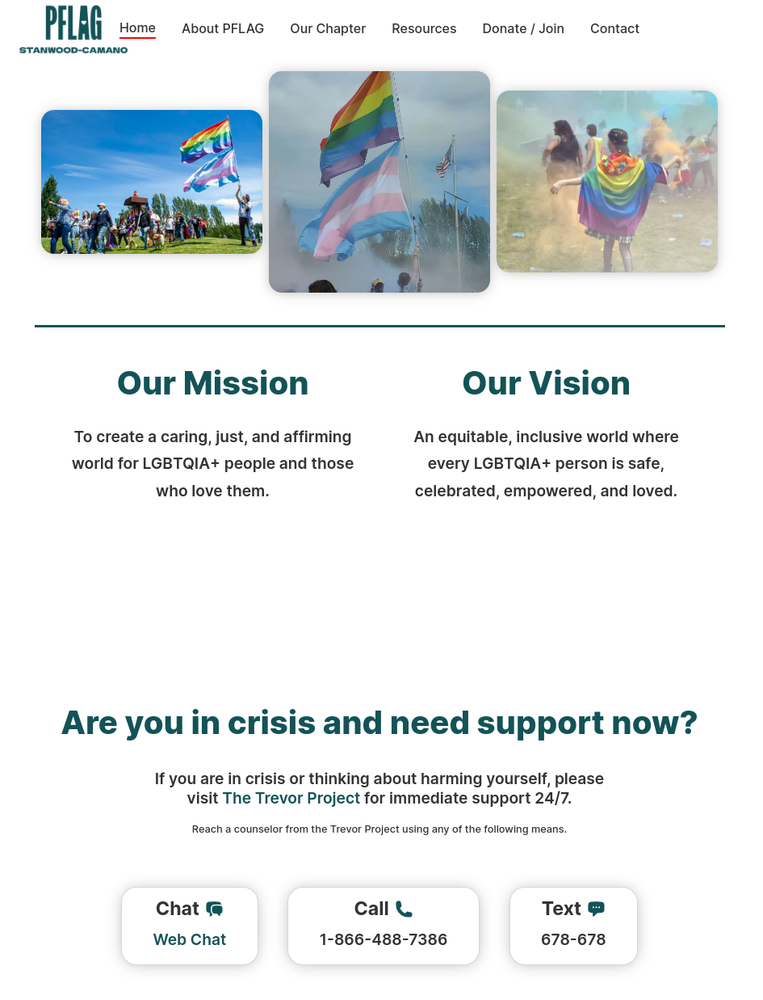

# PFLAG Stanwood-Camano

For this project, I developed a website for the [Stanwood-Camano chapter of PFLAG](https://pflagstanwoodcamano.org/), an LGBTQIA+ support organization.  I also host and maintain the site on an ongoing basis.

Straight HTML, CSS, no frameworks used. Git, Apache, Linode (hosting). 

|:--:| 
| *Screenshot of website.* |

2022-present
