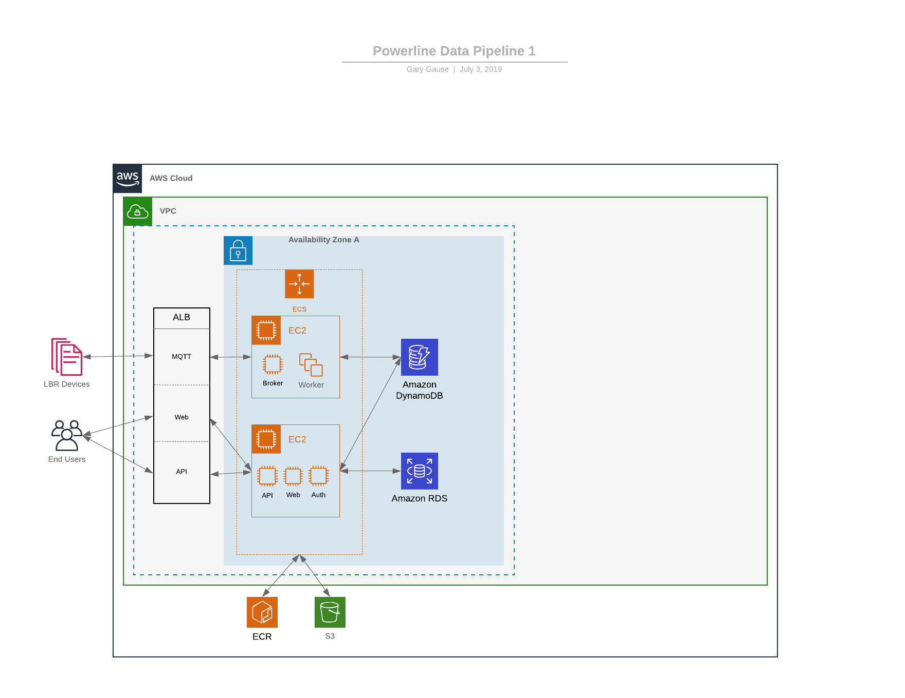

# The Powerline Project
Advanced data science, data engineering, hardware and software engineering project.  Powerline brought smart sensor technology to utilities and power line segments on a massive scale with the goal of detecting line failure before it happens in order to prevent forest fires.

In this project, I was responsible for and personally developed all of the Data Architecture, from raw data received from remote cellular devices, to ETL, storage, apis, web apps for visualization, data analysis, and machine learning for classification.  I also developed a Docker based infrastructure, security, monitoring, and alerting of events to support the needs of the utlity industry.  

Listed as Inventor on patents related to powerline sensor technology (2019, 2020).

AWS ECS, Docker, AWS PostgreSQL RDS, Python/Flask API, Python ETL, React Web, Jupyter, Pandas, Matplotlib, Numpy

This follows my standard Data Science Project Template.

## Understanding the Business

Recon Dynamics is an IoT company that uses smart sensors on power line segments to monitor the health of power lines and detect anomalies.  Powerline is the name of their branded product offering.

The business makes money through sales of sensor technology and by providing data to its customers.

## What questions are we trying to answer?

As this is a new product, the questions are fundamental in nature and key to the business's success.

- Is the data being collected of value?  Is it accurate, timely, and relevant?
- Can we detect anomalies in the data?
- Can we categorize anomalies by event type?  What types?  Potential anomalies we'd like to detect:
   - tree branch tapping the line
   - tree branch falling into the line
   - high wind events
   - line failure (falling to the ground)
   - loose line connections that require maintenance

After completion of the initial prototype testing and deployment into the field for "real-world" testing, an additional question was added:

- Did the RSSI (signal strength) of our devices improve after release of version X?

## Data Dictionaries

A data dictionary was created to identify the fields in the raw dataset and their value types, along with expected ranges of values.  Although proprietary in nature, the data took this general shape:

- 9 fields
- mostly numeric sensor data

## ETL

Although not part of every data science project, this project required development of ETL (Extract, Transform, Load) scripts as well as the Data Architecture to get the raw data into an Amazon RDS instance for accessibility.

|:--:|
| *Early version of the Data Architecture that I implemented.* |

AWS ECS, AWS RDS, Docker, Python, Flask API

## Query Library

Although proprietary in nature, a set of Jupyter notebooks were created to query the dataset.

## Exploratory Data Analysis

Several Jupyter notebooks were created to analyze and understand the data coming in from the sensors in the field.

Jupyter, Pandas, Matplotlib, Numpy

## Reporting

Real-time reporting and monitoring of sensor data was accomplished through a custom interactive web app written in React.

### Powerline Analytics

React web app for visualizing smart sensor data placed on powerlines.  Source code fully developed and maintained by me (2020).  Part of the Powerline Project.

|:--:| 
| *Screenshot of web app showing real-time visualizations of power line sensor data.  Chart shows acceleration experienced by this power line segment due to wind, vibrations, and in theory, the power line falling to the ground.  One, two, and three standard deviations from normal are shown for reference.* |

React, Axios, D3, S3, API

