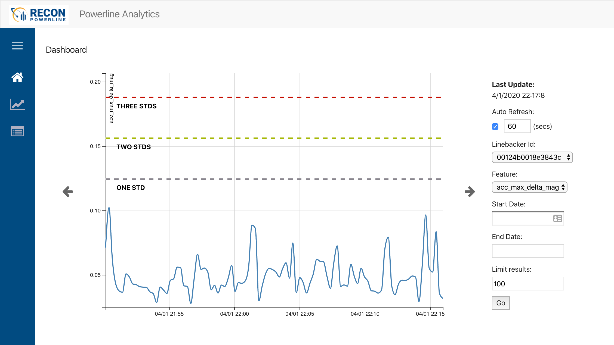

# The Powerline Project
Advanced data science, data engineering, hardware and software engineering project.  Powerline brought smart sensor technology to power line segments on a massive scale with the goal of detecting line failure before it happens in order to prevent forest fires.

In this project, I was responsible for and personally developed all of the Data Architecture, from raw data received from remote cellular devices, to ETL, storage, apis, web apps for visualization as well as a Docker based infrastruture, CI, security, and monitoring.

Listed as Inventor on patents related to powerline sensor technology (2019, 2020).

AWS ECS, AWS PostgreSQL RDS, Python/Flask API, Python ETL, React Web, Jupyter, Matplotlib, Numpy

## Powerline Analytics

React web app for visualizing smart sensor data placed on powerlines.  Part of the Powerline Project.

|:--:| 
| *Web app showing visualizations of power line sensor data.  Chart shows acceleration on the power line due to wind, vibrations, and in theory, power line falling to the ground.* |

React, Axios, S3, API

