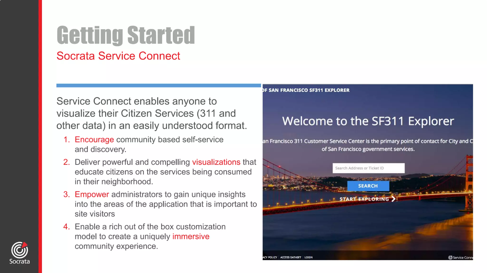
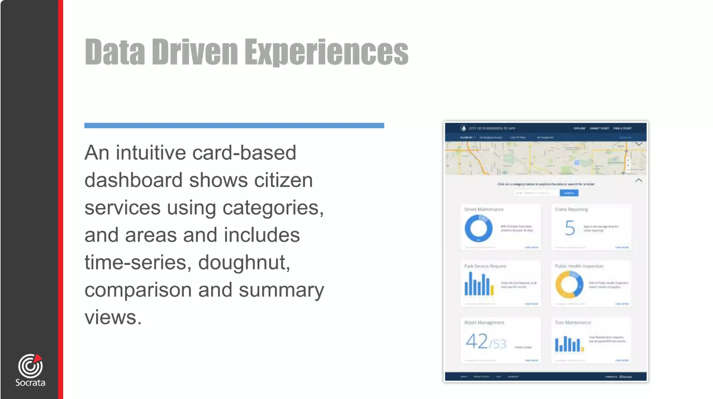
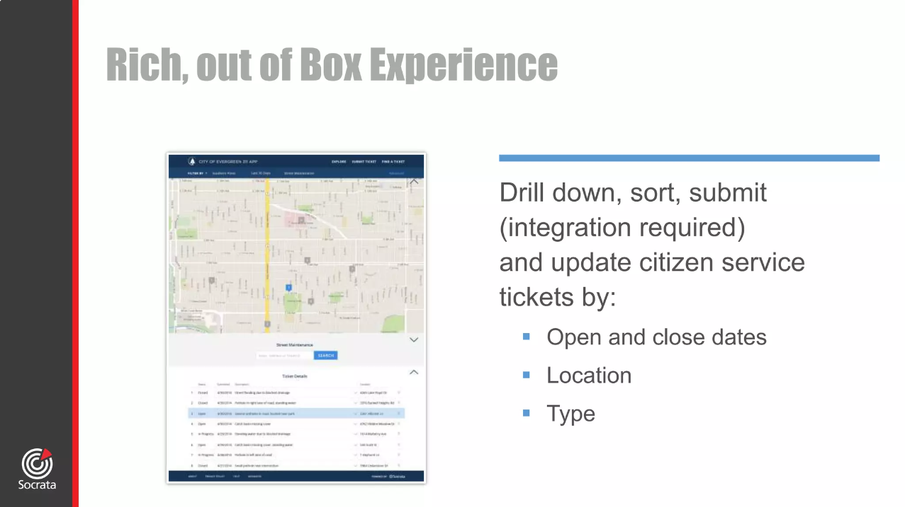
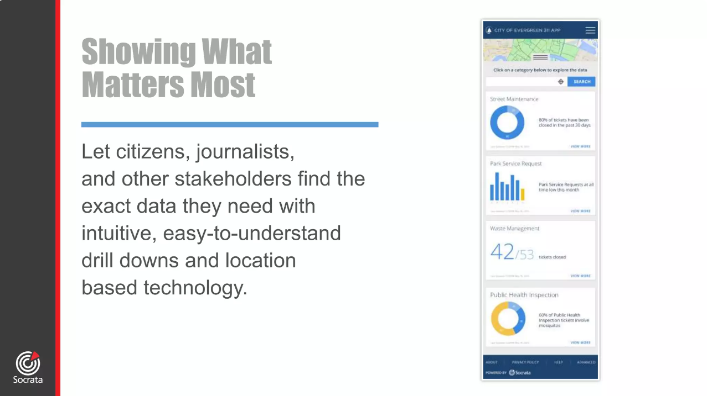

# Socrata Service Connect

Website for government data visualization.  I was solely responsible for all code development for this as well as the determining the best ways to visualize the data and its implementation.

Screen 1              | Screen 2
:-------------------------:|:-------------------------:
 | 

Screen 3              | Screen 4
:-------------------------:|:-------------------------:
 | 

Screen 5              
:-------------------------:
 |

Java, Spring, Javascript, D3.

2015
