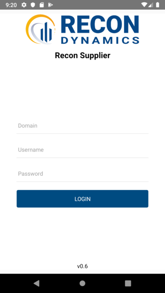
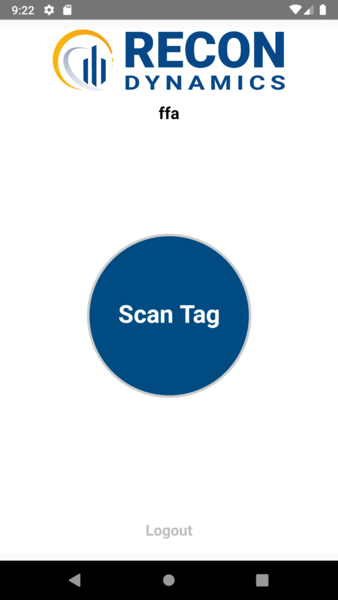
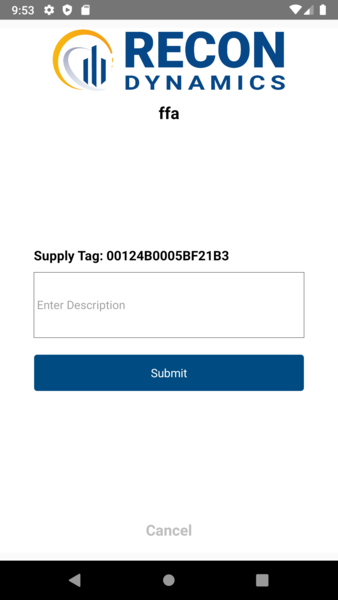

# TVSupplier

Mobile app used by suppliers to construction sites to track assets.

Written in React Native, this app allows a supplier to scan a QR code on an asset tracking tag and enter information about the asset being delivered to the job site.  The asset tracking tag then communicates with remote boxes on the job site and notifies users when the asset has arrived on site and what dock it is at.

Released on Android and iOs as an internal company app.  Interfaces with a backend python API for authentication and data.  Multi-tenant, company and job sites are determined by the login.

Login Screen               | Main Screen
:-------------------------:|:-------------------------:
 | 

Edit Screen               
:-------------------------:
 |

React Native, React Native Camera Kit, Axios, API

