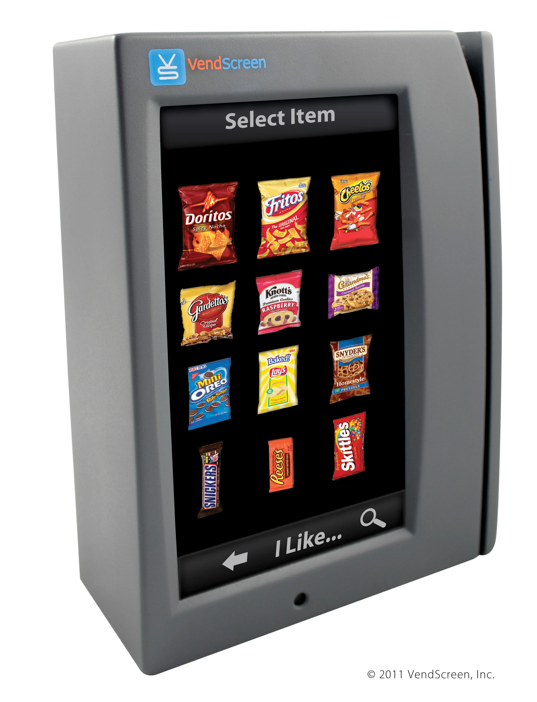
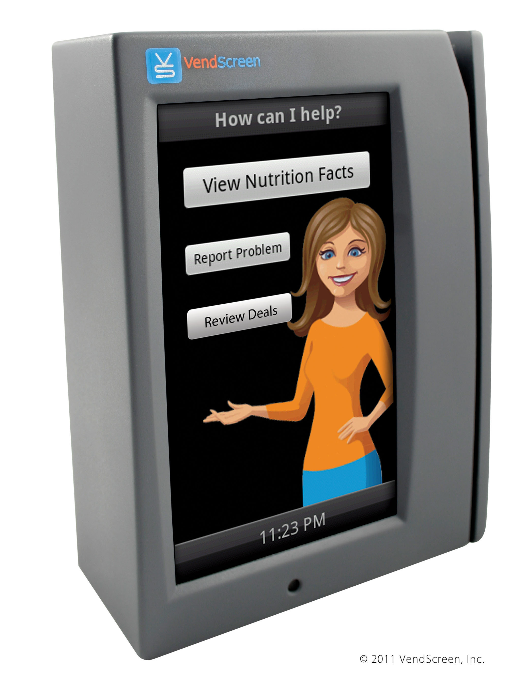

# VendScreen Realize

Android app developed for a custom version of the android os running on vending machines.  

App interfaced directly with the machine hardware to allow shopping cart selection of products and multiple item checkout with credit card.  Communicated via cellular with cloud services to track inventory levels, sales, and payment processing.

Product Screen               | Help Screen
:-------------------------:|:-------------------------:
 | 

## External Links

- [Press Release](https://www.prnewswire.com/news-releases/vendscreen-unveils-wireless-smart-device-with-touch-screen-interface-for-new-and-existing-vending-machines-130295118.html)
- [VendScreen Demo](https://www.youtube.com/watch?v=FlEoJq88aUk): Demo and testimonial of the VendScreen Realize app.

Native android, Java, C, lots of custom stuff.

2014
